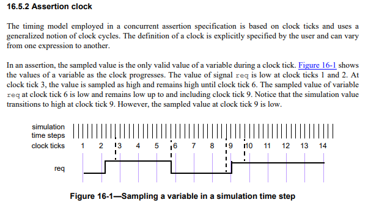

# Sampled And Past

_Right now, these are just unorganized notes that I want to commit._

Compile with `yosys -q sampled.ys`. For nmigen sample, compile with:

```
python sampled.py generate -t il sampled.il
yosys -q sampled_py.ys
```

Clean with `rm -rf sampled*.png sampled*.dot sampled.il`

## Sorted Notes

* Simulation is based on time slots. There are a number of time slots based in
  SystemVerilog; we only will look at Preponed (before assignments active
  in the current time step take effect) and Postponed (after active assignments
  in the current time step take effect) region.
  * Spec seems to imply time slots are associated with time steps. Both
    terms are used to refer to time slots in different places.
  * A clock tick _does not_ occur in every time slot (think of how Verilog
    simulations are done in nanoseconds, not in terms of active clock edges).
    See image below.
* Sampling in the Preponed region is equivalent to sampling in the previous
  Postponed region (4.4.2.1).
  * The function `$sampled` returns the sampled value of its argument
    (see 16.5.1) (16.9.3).
  * The sampled value of a variable in a time slot corresponding to time
    greater than 0 is the value of this variable in the Preponed region of this
    time slot (16.5.1).
  * In particular, if an expression contains a function call, to evaluate the
    sampled value of this expression, the function is called on the sampled
    values of its arguments at the time of the expression evaluation (16.5.1).
  * In an assertion, the sampled value is the only valid value of a variable
    during a clock tick (16.5.2).
* The clocking event, although optional as an explicit argument to the
  functions `$past`, `$rose`, `$stable`, `$changed`, and `$fell`, is required
  for their semantics (16.9.3).
  * `$past` returns the sampled value of _expression1_ in a particular time step
    strictly prior to the one in which `$past` is evaluated (see 16.5.1...)
    (16.9.3).

## A Worked Example



Using the above image, we can figure out the value of `req` in various
expressions. Post Val and Pre Val mean Value in "Postponed" and "Preponed"
regions. The Postponed value is the value that circuitry depending on `req`
will "see" going into the next time step.

`req` rises at clock tick 9:

|Tick                |8|9|10|11|12|
|--------------------|-|-|--|--|--|
|Post Val            |0|1| 1| 1| 1|
|Pre Val (`$sampled`)|0|0| 1| 1| 1|
|`$past`             |0|0| 0| 1| 1|

`req` rises before 9, after 8:

|Tick                |8|9|10|11|12|
|--------------------|-|-|--|--|--|
|Post Val            |0|1| 1| 1| 1|
|Pre Val (`$sampled`)|0|1| 1| 1| 1|
|`$past`             |0|0| 1| 1| 1|

`req` rises after 9, before 10:

|Tick                |8|9|10|11|12|
|--------------------|-|-|--|--|--|
|Post Val            |0|0| 1| 1| 1|
|Pre Val (`$sampled`)|0|0| 1| 1| 1|
|`$past`             |0|0| 0| 1| 1|


## Single FF

```
req -> FF -> q_req
       ^
       |
      CLK
```

`req` rises at clock tick 9:

|Tick              |8|9|10|11|12|
|------------------|-|-|--|--|--|
|`req` Pre Val     |0|0| 1| 1| 1|
|`q_req` Pre Val   |0|0| 0| 1| 1|
|`req` Post Val    |0|1| 1| 1| 1|
|`q_req` Post Val  |0|0| 1| 1| 1|

`req` rises before 9, after 8:

|Tick              |8|9|10|11|12|
|------------------|-|-|--|--|--|
|`req` Pre Val     |0|1| 1| 1| 1|
|`q_req` Pre Val   |0|0| 1| 1| 1|
|`req` Post Val    |0|1| 1| 1| 1|
|`q_req` Post Val  |0|1| 1| 1| 1|

`req` rises after 9, before 10:

|Tick              |8|9|10|11|12|
|------------------|-|-|--|--|--|
|`req` Pre Val     |0|0| 1| 1| 1|
|`q_req` Pre Val   |0|0| 0| 1| 1|
|`req` Post Val    |0|0| 1| 1| 1|
|`q_req` Post Val  |0|0| 1| 1| 1|

`$past` corresponds to to `q_req` Preponed Val.
`$sampled` corresponds to `req` Preponed Val and `$q_req` Postponed Val.

To capture a Preponed Val, it must be latched, otherwise it'll disappear
by the Postponed region.
